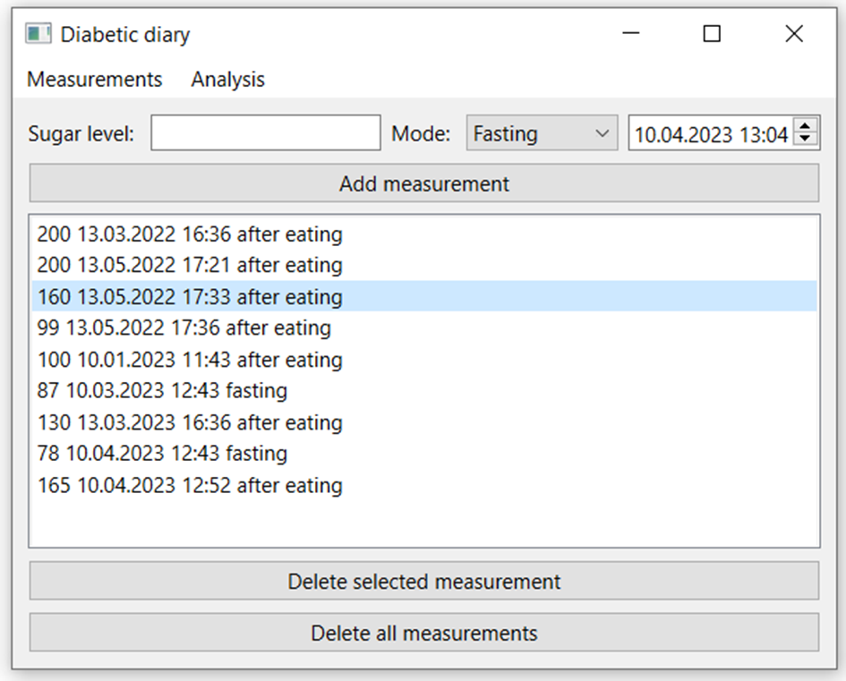
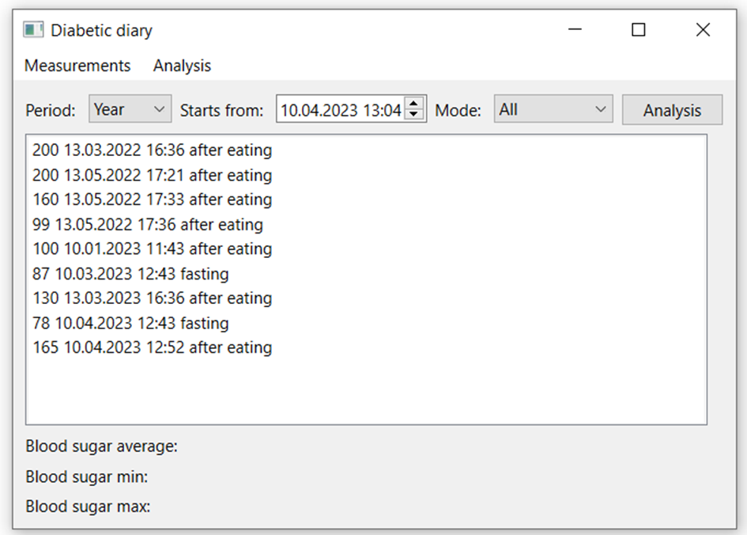
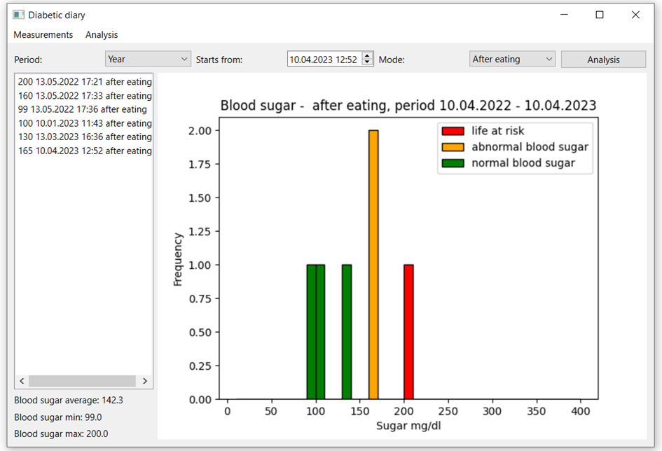

# Diabetic Diary
Application for collecting blood sugar measurement results and presenting their outcomes.
# Authors: 
Anna Szymańska, Dorota Wlazło

# Requirements
Python =3.8  
PySide6=6.4.2  
matplotlib~=3.6.3  
python-dateutil~=2.8.2

# Running the application:

Unpack the downloaded folder.
Install the required libraries from requirements.txt.
Run the program using the command line:  
a) navigate to the location of the unpacked folder.  
b) then use the command "python -m main".

# Functionality 

•	input of data, which is stored in a SQLite database,  
•	browsing of entered data,  
•	presentation of measurement results in the form of a graph,  
•	marking of measurements with values outside the normal range,  
•	the application allows for a summary of the results for a specified time range. 

# Usage

 Figure 1 shows the main page of the application, which includes an interface for entering a new measurement: typing the blood sugar level value in the field next to the label "Sugar Level", selecting the measurement mode using a drop-down list, and setting the date. Accepting the entered data involves clicking the "Add measurement" button. Other functionalities available on this page include deleting all measurements using the "Delete all measurements" button, and deleting a specific measurement by selecting it on the list and clicking the "Delete selected measurement" button. Clicking the "Analysis" tab navigates to the second page of the application, as shown in Figure 2.

The second page of the application is used to present results from a specified range and their statistics. Clicking the "Analysis" button calculates the statistics of the data from the specified range and selected type of measurement. If the selected measurement type is different from "All", the application also displays a distribution of measurements on a histogram (Figure 3) in addition to the statistics.

